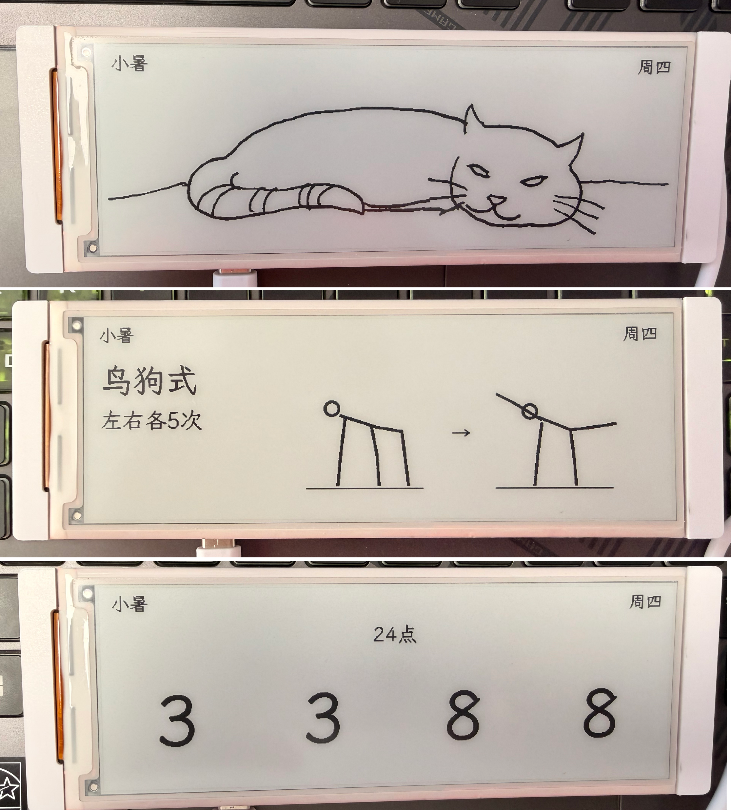
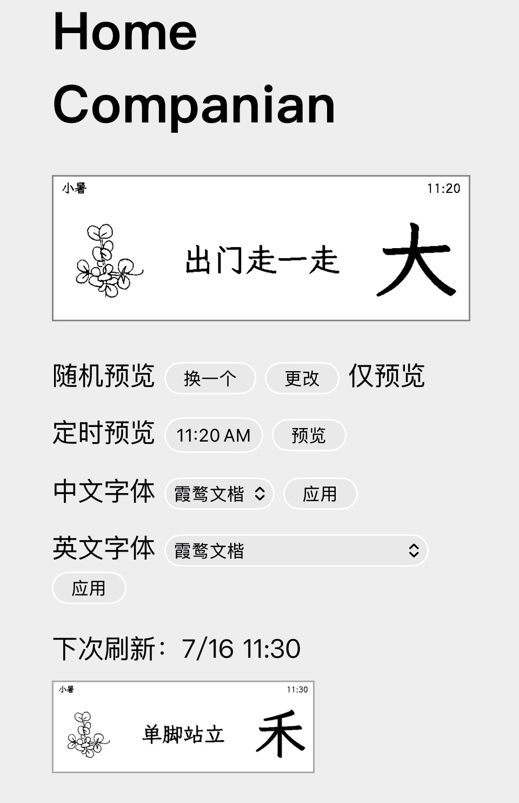
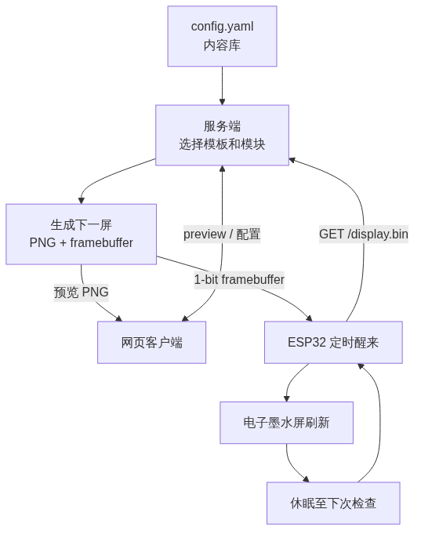

# 家宠

用于支持嵌入式系统的家庭电子小管家宠物，主要目的是给单片机提供post/get的服务，但是也有相对应的网页版本。网页版本会模拟在电子屏幕上的显示效果。

## 效果示例

设备端：



网页端：



## 工作流程



## 目标人群

全家，老少皆宜。只提供简单互动

 - 确认
 - 取消
 - 也许考虑支持方向键和简易菜单

## 使用场景

挂在墙上的公告栏，可以显示的东西包含以下

 - 显示一个拉伸动作，看到的人就顺便跟着做了一下，强身健体
 - 显示一句话鸡汤，看的人会心一笑
 - 显示一个家务小任务，看到的人点击领取，并且顺手就做了，获得奖币。任务由用户提供
 - 推荐一个打卡任务，做了就点个确认
 - 放一个家庭相册里的图，素材由用户提供
 - 放一个小宠物，如果点击喂食就会”吃“两口
 - 放一个小绿植，如果点击浇水就会慢慢长大。
 - 其它可互动小物件待定
 - 显示一个小数学题

公告栏包括一个极简状态栏
 - 中间显示当前节气
 - 右侧显示星期

当前显示内容可以有不同模式
 - 定时模式：比如固定每天12点显示散步，1pm显示读书。
 - 随机模式：比如每60分钟随机显示一个内容

## 硬件

 - e-ink
 - 屏幕大小为5.79 inch,792x272 resolution（横屏），但是后续可支持更多规格。

## 模块

`<library_dir>`存放所有的素材库

 - 识字：从用户提供的库里选取汉字。完整字表在 `chinese/full.md`，启用的子集在 `chinese/select.md`。
 - 数学游戏：从 `math/problems.csv` 随机选择 24 点等题目；24 点画面显示游戏标题和四个数字。
 - 健身：从 `health/exercises.csv` 随机选择徒手动作，显示两帧极简示意图。
 - 一句话鸡汤，在wisdom/
 - 小任务，包括家务和打卡，在items.csv
 - 小图，在images/，包括不同子集，类别在index.csv,图片在各个同名文件夹
 - 家庭相册，在photos/
 - 趣事：在stories/

## 可定制

### 配置文件
 - `~/.config/home_companian/config.yaml` 存储程序设置和 `library_dir`。
 - `<library_dir>/items.csv` 使用 `id,type,text` 三列存储文字项目。
 - `<library_dir>/health/exercises.csv` 使用 `id,name,dose,instruction` 四列存储动作。
 - `<library_dir>/math/problems.csv` 使用 `id,type,question,answer` 四列存储题目；答案暂不显示。
 - `<library_dir>/photos/` 和 `<library_dir>/images/` 只存储已处理的成品图片。

### 排版

排版拆成模板、模块和编排三部分：

 - 程序提供若干固定模板。模板决定 topology，每个区域使用模板内部的数字编号。
 - 用户不能修改模板的坐标和尺寸，但可以在 `config.yaml` 中选择模板。
 - 模块负责提供内容并在模板给定的矩形区域内渲染，不拥有绝对坐标。
 - 用户编排记录当前模板中每个数字区域放哪个模块；空区域允许保持白色。
 - 顶部 44px 是固定状态栏，不参与模板；792x272 屏幕的模板只管理下方 792x228 内容区。
 - 状态栏模块与内容模块是两套独立系统。状态栏按 `left`、`center`、`right` 三组横向排列，不能放入模板区域。

```yaml
status_bar:
  left: []
  center:
    - module: solar_term
  right:
    - module: weekday
```

当前内置 `weekday`、`time`、`solar_term` 和 `date` 状态栏模块。默认只显示中央节气和右侧星期；`time` 和 `date` 保留但不显示。节气根据太阳视黄经计算，并按 UTC+8 日期切换。左右边距为 16px，模块间距为 12px，发生越界或重叠会报错。

当前已经提供一个保持原有全屏行为的最小模板和模块：

```yaml
panel:
  template: landscape_1
  slots:
    1:
      module: items
```

也已提供首个双区域模板：

```yaml
panel:
  template: landscape_2
  slots:
    1: {module: items}
    2: {module: chinese, source: select}
```

三区域模板的左右区域为 200x200 正方形，中间为 368x228：

```yaml
panel:
  template: landscape_3
  slots:
    1: {module: images, collections: "plants,animals"}
    2: {module: items}
    3: {module: chinese, source: select}
```

`images` 模块从 `collection: plants` 指定的单个目录，或从 `collections: "plants,animals"` 指定的多个 `<library_dir>/images/<collection>/` 目录中随机选择处理后的 PNG，并避免连续重复。素材可以是高分辨率灰度图；运行时按模板区域保持比例缩放、白底居中，再转换为 1-bit。集合内的 `raw/` 子目录不参与轮换。

`chinese/full.md` 使用“一年级”至“六年级”的 Markdown 标题，每个标题下连续书写对应汉字，空白会被忽略。`chinese/select.md` 只保存启用的汉字；程序去重并保持首次出现顺序。如果包含非汉字、缺少年级标题，或选择了 `full.md` 中不存在的字，配置加载会报错。

健身模块使用全屏模板时的配置：

```yaml
panel:
  template: landscape_1
  slots:
    1: {module: health}
```

每个动作的两帧图片位于 `health/images/<id>/1.png` 和 `2.png`。仓库中的 `health_diagram_utility.py` 可生成当前 8 个原创黑白线稿动作；模块会在全屏和小区域中自动调整排版。画面只显示动作名、次数/时长和两帧姿势，`instruction` 仅保存在 CSV 中。

数学模块可混合两类题，也可以只选一类：

```yaml
panel:
  template: landscape_1
  slots:
    1: {module: math, type: game24}  # arithmetic / thinking / game24 / all
```

`answer` 为以后互动预留，第一版不会通过画面或设备响应显示答案。

后续多区域配置将沿用同一结构：

```yaml
panel:
  template: landscape_3
  slots:
    1:
      module: chinese
      source: select
    2:
      module: wisdom
    3:
      module: items
      mode: random
```

未来增加“屏幕编辑器”：用户可以在网页中浏览内置模板和可用模块，选择模板，并通过点击或拖拽把模块放入数字区域。编辑器写回的仍是上述配置，不引入另一套布局模型。当前只通过 YAML 配置，不实现编辑器。

## 运行

安装依赖：

```bash
python3 -m pip install -r requirements.txt
```

首次运行可以直接使用示例配置，并通过 `--port` 指定端口：

```bash
python3 server.py --config config.example.yaml --port 8000
```

需要使用默认配置位置时，先复制示例配置：

```bash
mkdir -p ~/.config/home_companian
cp config.example.yaml ~/.config/home_companian/config.yaml
python3 server.py --host 0.0.0.0 --port 8080
```

启动后访问 `http://localhost:<port>/` 查看网页预览。

默认网页预览显示服务端最后一次通过 `/display.bin` 发给设备的完整画面；手动随机/定时预览和“更改”不会覆盖它。“更改”只替换下一屏。当前设备画面保存在 `~/.local/state/home_companian/current.png`，服务重启后仍可恢复；设备从未请求过画面时不会拿下一屏冒充当前画面。

设备刷新周期由配置控制：

```yaml
refresh_minutes: 30
active_start: "07:00"
active_end: "22:00"
```

设备在活跃时段每 30 分钟检查一次，夜间深睡；服务端通过响应头告知设备下次唤醒时间。

字体候选和当前字体存放在配置中：

```yaml
font: /usr/share/fonts/TTF/LXGWWenKai-Medium.ttf
fonts:
  霞鹜文楷: /usr/share/fonts/TTF/LXGWWenKai-Medium.ttf
  思源黑体: /usr/share/fonts/adobe-source-han-sans/SourceHanSansCN-Regular.otf
latin_font: /usr/share/fonts/TTF/CaskaydiaCoveNerdFont-Regular.ttf
latin_fonts:
  Caskaydia Cove Nerd Font: /usr/share/fonts/TTF/CaskaydiaCoveNerdFont-Regular.ttf
  JetBrains Mono Nerd Font: /usr/share/fonts/TTF/JetBrainsMonoNerdFont-Regular.ttf
  Noto Sans Mono: /usr/share/fonts/noto/NotoSansMono-Regular.ttf
  霞鹜文楷: /usr/share/fonts/TTF/LXGWWenKai-Medium.ttf
  思源黑体: /usr/share/fonts/adobe-source-han-sans/SourceHanSansCN-Regular.otf
```

网页中文字体菜单从 `fonts` 生成，英文字体菜单从 `latin_fonts` 生成；应用后分别写回 `font` 和 `latin_font`，并影响后续网页和设备画面。

## 图像处理

把照片转换成默认 792x228 内容区使用的 1-bit PNG：

```bash
python3 image_utility.py input.jpg output.png
```

默认居中裁切铺满，并使用 Floyd–Steinberg 抖动，适合照片。双栏模板或其他区域通过 `--size` 指定区域尺寸：

```bash
python3 image_utility.py input.jpg output.png --size 528x228
```

线稿可关闭抖动并使用固定阈值；需要保留整张图时使用白边适配：

```bash
python3 image_utility.py input.png output.png --binarize threshold --threshold 180
python3 image_utility.py input.jpg output.png --fit contain --autocontrast
```

默认输出是指定尺寸的黑白 1-bit PNG，不包含顶部状态栏、8 像素硬件接缝或 framebuffer 旋转。需要供不同模板复用的高分辨率主图时，使用 `--binarize grayscale`；图片模块会在运行时缩放并完成最终二值化。透明区域按白色处理。`--trim 2` 可从输入四边各裁掉 2px，`--content-scale 0.85` 可让主体缩小并居中留白；其他可选参数还包括 `--invert`。
